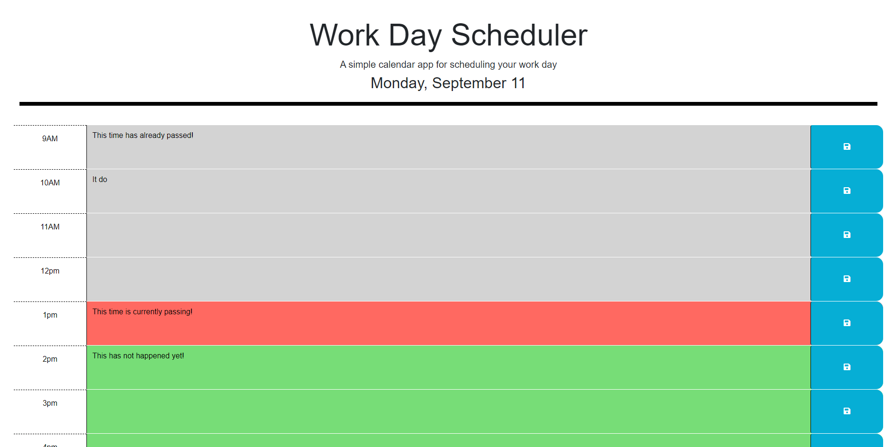

# WORKDAY SCHEDULER PROJECT

## Description

The Work Day Scheduler is to be an app that allows users to plan their day. It displays the current day at the top of the page and provides hourly time slots between 9am and 5pm for users to enter information. As time continues, reloading the page will cause the slots to change color depending on if the time has passed or is currently passing.

## Installation

N/A

## Usage

Click inside the text input between a listed time and the blue save button.
Type in your plan for that time, then click the blue save button for that row, on the right.
You will get a message saying the event was saved under the black bar at the top of the page.
Reload the page as much as you want, as long as you are on the same device the event saved will reappear.

Project is deployed at: https://mattmrob.github.io/Work-Day-Scheduler/

## Credits

Starter code prodived by UC Berkeley

## License

N/A